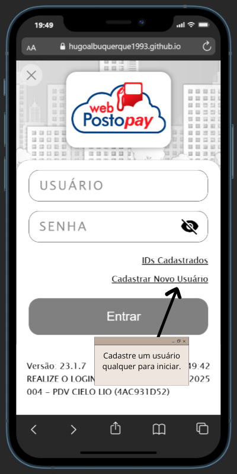
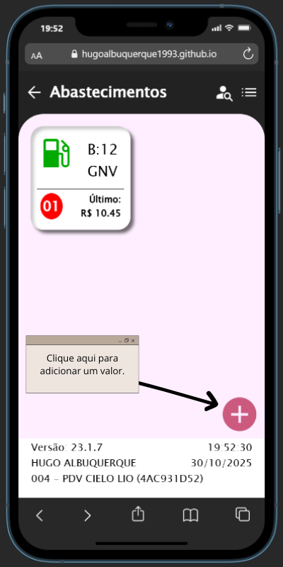
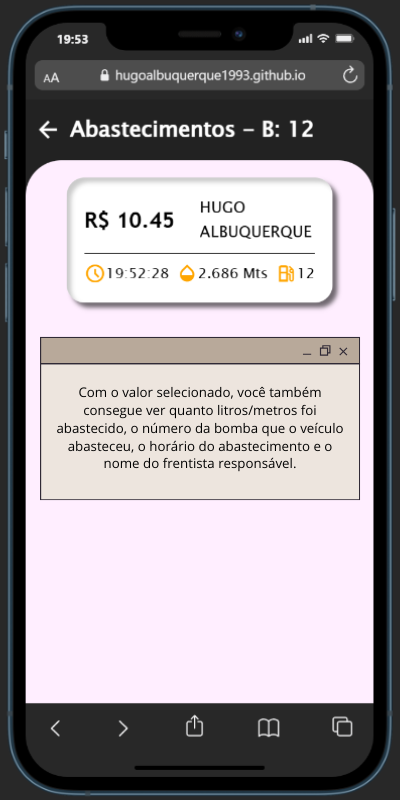

# Web Posto Pay Clone

---

<!--
## 📋 Índice

[🚀 Acesso ao Projeto](#🚀-acesso-ao-projeto)
[📸 Pré-visualizações](#📸-pré-visualizações)
[🧭 Visão Geral](#🧭-visão-geral)
[🧱 Tecnologias Utilizadas](#🧱-tecnologias-utilizadas)
[💡 Funcionalidades e Interfaces](#💡-funcionalidades-e-interfaces)
[🧠 Objetivos e Aprendizados](#🧠-objetivos-e-aprendizados)
[👨‍💻 Autor](#👨‍💻-autor)
[📜 Licença](#📜-licença)

---
-->

## 🚀 Acesso ao Projeto

🔗 [Acesse o Web Posto Pay Clone](https://hugoalbuquerque1993.github.io/web_posto/index.html)  
Web Posto Pay é um aplicativo móvel. O APP funciona em desktop, porém, para uma melhor experiência, tente abrir o app no smartphone ou utilize extesões de Simulador de Telefone no seu navegador desktop.

---

## 📸 Pré-visualizações

  

---

## 🧭 Visão Geral

O **Web Posto Pay Clone** é um projeto web desenvolvido para demonstrar minhas habilidades em **criação de interfaces e funcionalidades front-end** utilizando **HTML, CSS e JavaScript**.  
Trata-se de uma reprodução conceitual da interface do aplicativo mobile de pagamento por maquininha usado em postos de combustível, simulando as principais interações do sistema real.

> 💡 Este projeto foi **idealizado e desenvolvido integralmente por mim**, de forma independente.  
> Foi uma **iniciativa pessoal**, criada para exercitar minha capacidade de transformar ideias em interfaces funcionais e intuitivas — sem reutilização de código ou conceito de terceiros.

---

## 🧱 Tecnologias Utilizadas

- **HTML5** — estrutura semântica das páginas
- **CSS3** — estilização, layout e responsividade
- **JavaScript (ES6)** — interatividade e controle da navegação
- **GitHub Pages** — hospedagem e acesso público do projeto

> É importante destacar que o código ainda não foi totalmente estruturado, pois, apesar de se tratar de um projeto pessoal, o desenvolvimento envolveu um processo de aprendizado contínuo. Durante a construção do aplicativo, novas técnicas e abordagens mais avançadas foram sendo aplicadas gradualmente. Uma refatoração poderá ser realizada, caso seja necessário.

---

## 💡 Funcionalidades e Interfaces

- Tela de **login**
- **Menu lateral retrátil** com navegação dinâmica
- Seção de **seleção das bombas de combustível**
- Escolha de **valores de abastecimento** por bomba
- Tela de **formas de pagamento** (simulação)

> As interfaces foram projetadas para oferecer uma **experiência fluida e intuitiva**, com foco na navegação simples e design limpo.

---

## 🧠 Objetivos e Aprendizados

Durante o desenvolvimento deste projeto, o foco foi:

- Praticar o **desenvolvimento front-end** (HTML, CSS e JavaScript), reforçando fundamentos de **POO** e manipulação do **DOM**.
- Criar uma **navegação funcional** entre múltiplas telas, simulando o fluxo real de um app original.
- Aplicar princípios de **UX/UI**, garantindo um design intuitivo, com hierarquia visual clara, uso consistente de espaçamentos, tipografia adequada e feedback visual para as ações do usuário.
- Implementar **cadastro e validações de resposável**, para que cada colaborador tenha acesso aos seus respectivos abastecimentos.

---

## 👨‍💻 Autor

**Hugo Albuquerque**

Desenvolvedor Front-End • Foco em UX/UI e aplicações web intuitivas • Entre em contato!

> ⚠️ _Desenvolvido exclusivamente para fins de aprendizado e portfólio. Este projeto é conceitual e não possui vínculo com empresas, sistemas ou marcas reais. Web Posto Pay é um app que passa por atualizações contínuas, é possível que determinadas interfaces apresentadas neste projeto não correspondam fielmente às versões mais recentes do app original._

## 📜 Licença

Distribuído sob a licença [MIT License](LICENSE).  
Você é livre para usar, modificar e compartilhar, desde que mantenha os créditos originais.

---
